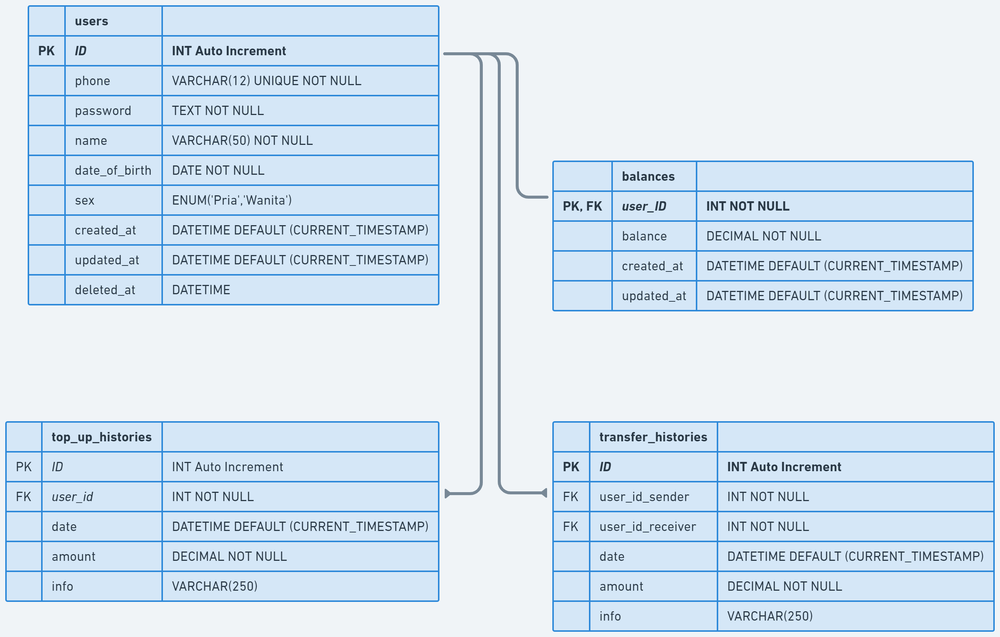

# Project Account Service

## 💻 About The Project

Account Service is a CLI based app in digital financial service built with Golang and MySQL.

## ✨ App Features
:white_check_mark: Users can operate **create**, **read**, **update** and **delete** on **user's** data. Registered users also can **login** to app.\
:white_check_mark: Users can top-up saldo.\
:white_check_mark: Users can transfer to other account.\
:white_check_mark: Users can view top-up history.\
:white_check_mark: Users can view transfer history.\
:white_check_mark: Users can view other account by search or view all.

## 🛠 &nbsp;Build App & Database


## 🗃️ ERD



## Run Locally

Clone the project

```bash
https://github.com/kharismajanuar/project-account-service.git
```

Go to the project directory

```bash
cd project-account-service
```
## 👥 Credit

[](https://github.com/hdkef)
[](https://github.com/kharismajanuar)

<h3>
<p align="center">:copyright: 2023  </p>
</h3>

<p align="right" style="padding: 5px; border-radius: 100%; background-color: red; font-size: 2rem;">
  <b><a href="#Project-Account-Service">BACK TO TOP</a></b>
</p>
